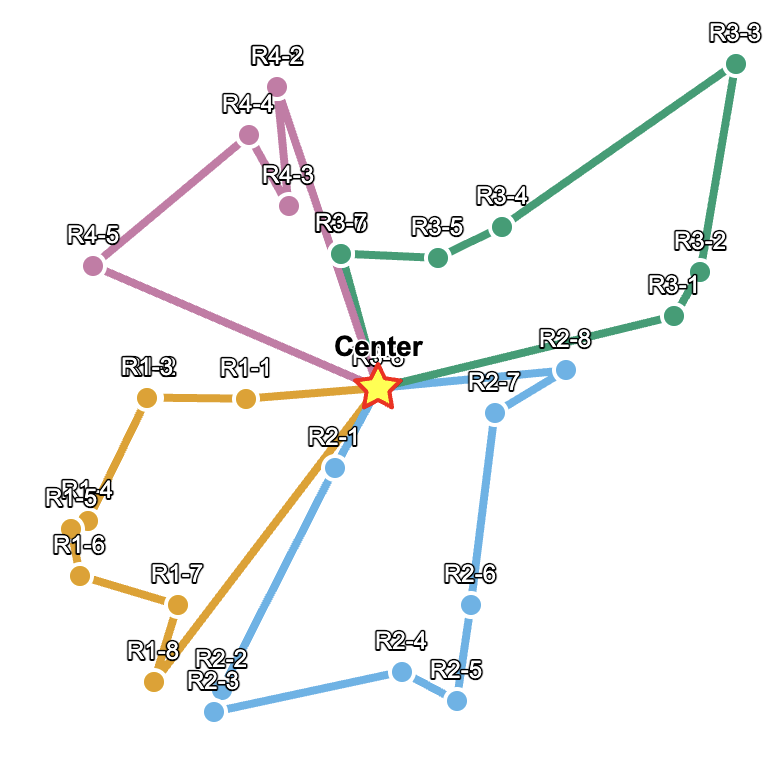
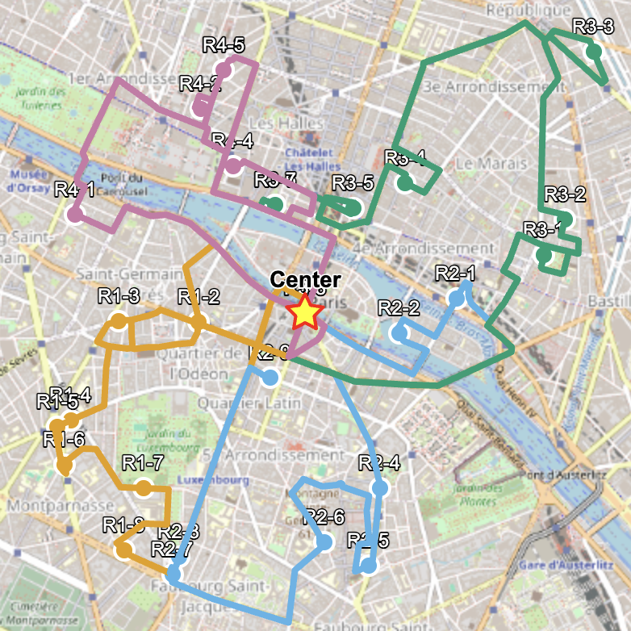
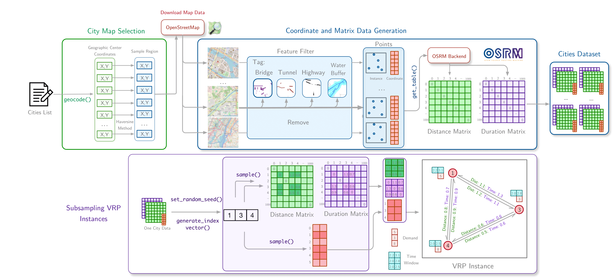
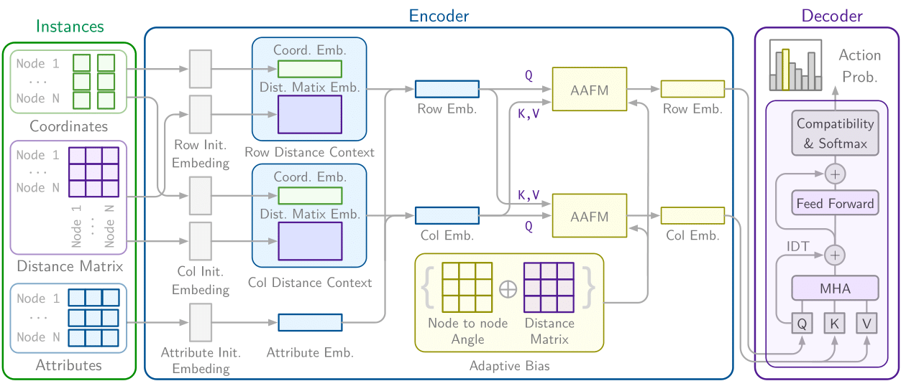

# Real Routing NCO

[](https://arxiv.org/abs/2503.16159)
[](https://opensource.org/licenses/MIT)
[](https://huggingface.co/ai4co/rrnco)
[](https://huggingface.co/datasets/ai4co/rrnco)

<div align="center">
<i> RRNCO has been accepted at the ICLR 2026! 🇧🇷🥳</i>
</div>

### Problem

Most NCO methods use simplified routing with 2D Euclidean distance. This is not realistic for real-world applications which can have complex 1) _distance matrices_ and 2) _duration matrices_ between locations because of road networks, traffic, and more.

<p align="center">
  
<br>
  <em>Left: previous works with simplified routing. Right: RRNCO with real-world routing!</em>
  <br>
</p>

How can we bridge this gap between toy and real settings?

We need two things:

1) A **dataset** with real-world routing information
2) A **model** that can handle such data -- not only node but also _edge_ information

### Solution 1: RRNCO Dataset

We introduce the RRNCO (Real Routing NCO) dataset, which contains real-world routing information for 100 cities around the world, from which instances can be subsampled and generated on the fly

<p align="center">
  
  <br>
    <em>RRNCO data generation pipeline</em>
<br>

### Solution 2: The RRNCO Model

The RRNCO model efficiently processes topology information by leveraging several techniques including scale adaptive biases

<p align="center">
  
  <br>
    <em>RRNCO model architecture</em>
<br>

## Installation

We use [uv](https://github.com/astral-sh/uv) (extremely fast Python package manager) to manage the dependencies:

```bash
uv venv --python 3.12 # create a new virtual environment
source .venv/bin/activate # activate the virtual environment
uv sync --all-extras # for all dependencies
```

Note that this project is also compatible with normal `pip install -e .` in case you use a different package manager.

### Data download

Download data and checkpoints
To download the data and checkpoints from HuggingFace automatically, you can use:

```bash
python scripts/download_hf.py
```

You may use the option "--no-data" to skip the dataset or "--no-models" to skip the checkpoints.

## Data generation

> [!TIP]
> This is already done when you download the dataset from HuggingFace. You can skip this step if you only want to use the pretrained models.

### Dataset generation

Instructions on how to install the OSRM backend and generate (new) datasets [data_generation](data_generation/README.md) folder.

After generating city data using the data generation pipeline, move the generated files to the following directory:

`data/dataset/{city}/{city}_data.npz`

For example, if the city is Seoul, the data file should be located at:

`data/dataset/Seoul/Seoul_data.npz`

Additionally, the file `data/dataset/splited_cities_list.json` contains a predefined split of cities into training and test sets. If you wish to modify the training cities, simply edit the list under the `"train"` key in this JSON file.

### Test instances generation

To (re)generate the test dataset (included in HuggingFace already):

```bash
python scripts/generate_data.py
```

This will generate test instance from the dataset provided above.

## How to run

To get started with running RRNCO, please follow the steps below:

### Training

To train a model, use the `train.py` script. For example, to train a model for the ATSP problem:

```bash
python train.py experiment=rrnet env=atsp
```

Available environment options are:

- atsp (Asymmetric TSP)
- rcvrp (Real-world Capacitated VRP(ACVRP))
- rcvrptw (Real-world Capacitated VRP with Time Windows(ACVRPTW))

You can also configure experiment settings using the file `config/experiment/rrnet.yaml`.

### Model Testing

You can evaluate a trained model using the `test.py` script. Make sure to provide the correct dataset path via `--datasets` and model checkpoint via `--checkpoint`.

Usage of `test.py`:

```
usage: test.py [-h] [--problem PROBLEM] [--datasets DATASETS] [--decode_type DECODE_TYPE] [--batch_size BATCH_SIZE] [--checkpoint CHECKPOINT] [--device DEVICE] [--no_aug] [--problem_size PROBLEM_SIZE]

options:
  -h, --help            show this help message and exit
  --problem PROBLEM     Problem name: hcvrp, omdcpdp, etc.
  --datasets DATASETS   Filename of the dataset(s) to evaluate. Defaults to all under data/{problem}/ dir
  --decode_type DECODE_TYPE
                        Decoding type. Available only: greedy
  --batch_size BATCH_SIZE
  --checkpoint CHECKPOINT
  --device DEVICE
  --no_aug              Disable data augmentation
  --problem_size PROBLEM_SIZE
```

- Supported problems: atsp, rcvrp, rcvrptw
- Checkpoints: `checkpoints/{problem}/epoch_199.ckpt`
- Datasets: `data/{problem}/{problem}_n100_seed3333_{distribution_type}.npz` (distribution_type: `in_distribution`, `out_of_distribution`, `in_distribution_cluster` , which correspond to the ones used in the paper)

Examples for different tasks:

**ATSP**

```bash
python test.py --problem atsp --datasets data/atsp/atsp_n100_seed3333_in_distribution.npz --batch_size 32 --checkpoint checkpoints/atsp/epoch_199.ckpt
```

**RCVRP**

```bash
python test.py --problem rcvrp --datasets data/rcvrp/rcvrp_n100_seed3333_in_distribution.npz --batch_size 32 --checkpoint checkpoints/rcvrp/epoch_199.ckpt
```

**RCVRPTW**

```bash
python test.py --problem rcvrptw --datasets data/rcvrptw/rcvrptw_n100_seed3333_in_distribution.npz --batch_size 32 --checkpoint checkpoints/rcvrptw/epoch_199.ckpt
```

### Citation

If you find RRNCO valuable for your research or applied projects:

```bibtex
@inproceedings{son2026rrnconeuralcombinatorialoptimizationrealworldrouting,
  title     = {Towards Real-World Routing with Neural Combinatorial Optimization},
  author    = {Son, Jiwoo and Zhao, Zhikai and Berto, Federico and Hua, Chuanbo and Cao, Zhiguang and Kwon, Changhyun and Park, Jinkyoo},
  booktitle = {Proceedings of the International Conference on Learning Representations (ICLR)},
  year      = {2026},
  url       = {https://openreview.net/forum?id=sKvo9ZZfpe}
}
```